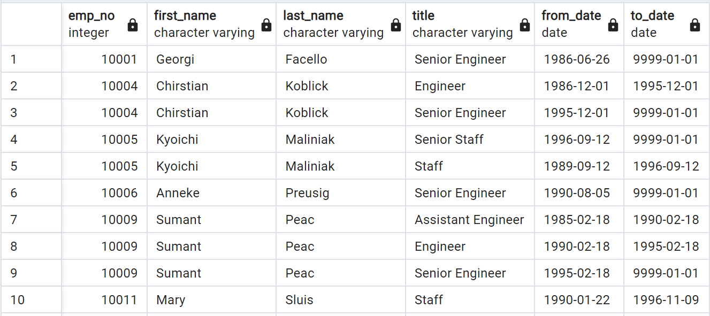

# Pewlett-Hackard-Analysis

## Project Overview
The purpose of this project is to further prepare Pewlett Hackard for the upcoming "silver tsunami", which is a mass retiring of employees due to being aged out of the work force. Pewlett Hackard has thousands of employees in this age range and need to know exactly how this will impact their work force and where to prepare. The parameters focused on in this analysis are:

1. The total number of employees reaching retirement range
2. The titles of these employees
3. How many in each unique title
4. How many employees are eligible to mentor new or rising employees

## Resources

The resources used in this analysis are six csv files from the company containing information about the employees. An ERD (entity-relationship diagram) was created using the website Quick DBD to conceptualize the relationships and interconnecting data from the different tables. This allows the analyst to determine how and where the data can be joined to analyze different data aspects side by side, helping to visualize the schema. PgAdmin 4 was used to run Query SQL to then create the tables based on the ERD. VSCode was also used to store the code from PgAdmin 4 as a safety net.

## Results

The first deliverable is a list of the retiring employees, the head of which is shown below:

